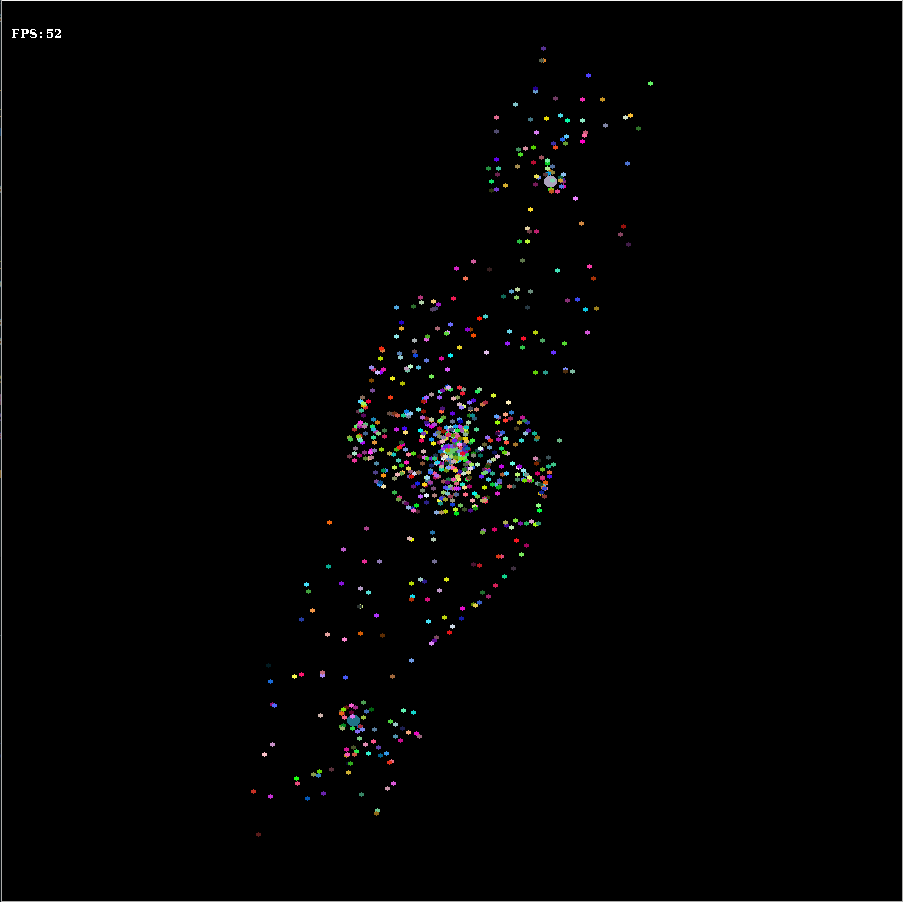
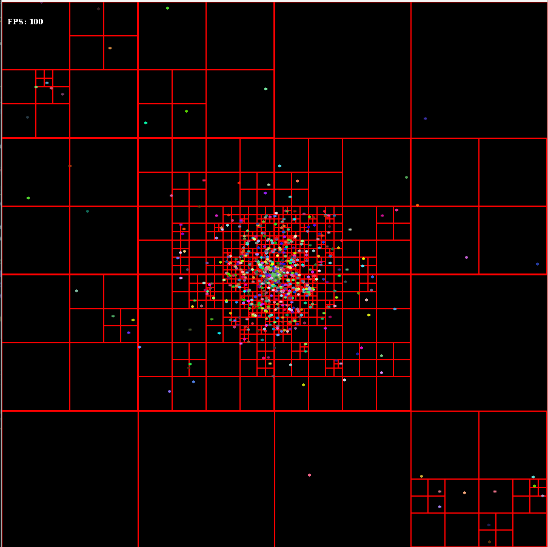
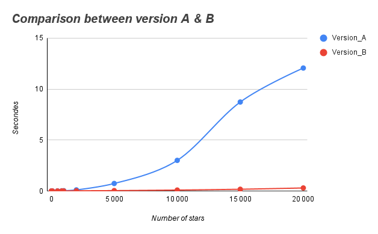

# Galaxy Simulation Report

## User guide
To compile the program, run the following command:
```bash
make
```
> This will build the executable of the program.

To execute the program, run the following command:
```bash
./bin/galaxy.out ./data/stars_100.txt 
```
> Note: Available options are:
> --quad : Use quadtree to perform the simulation.
> --show : Visualize the quadtree during the simulation.

## State of two versions of the program
- ### Version A:
  - The first version of the simulation is performed going through the stars in the file `stars_100.txt`.
  - So the complexity of the algorithme is O(n^2).
  > All the necessary implementation is working.

 

- ### Version B:
  - The second version is performed using a quadtree.
  - So the complexity of the algorithme is O(n log n).
  > All the basis implementation is working.
  > We tried to make collisions's between works but it didn't work.



## Progress of the project
- One person make the first version of the program.
- The second person make the second version of the program using a quadtree.

## Comparison of the two versions



The comparison between the two versions is make using the average time of each tour of simulation.

> Comment: <br>
> We can notice that when the numbers of stars is less than 1000, there is no difference between the simulation

> There is some hidden constant in the complexity of the simulation.
